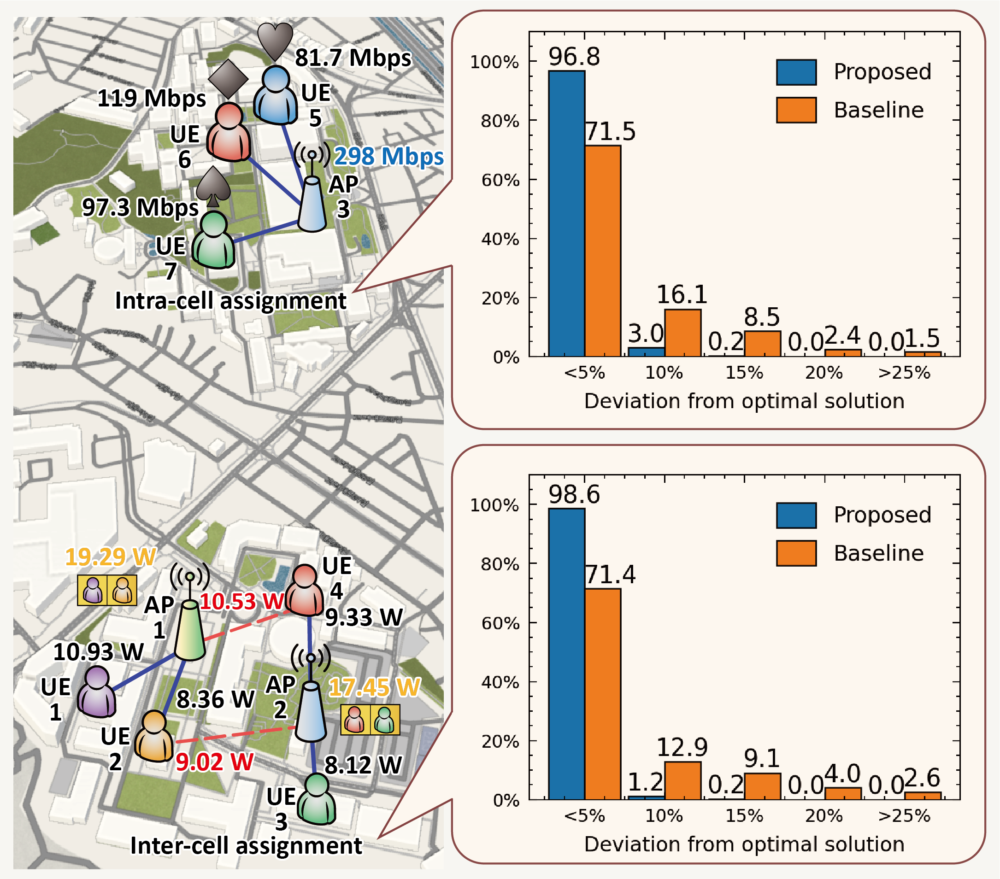
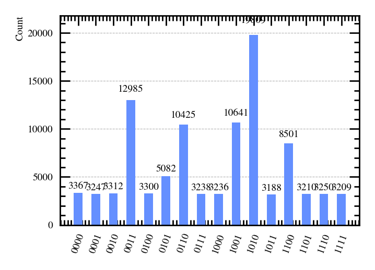
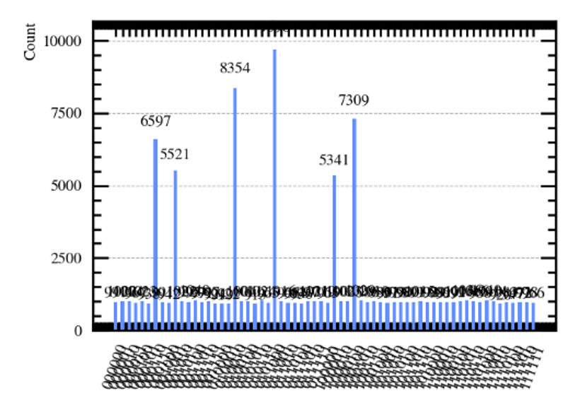
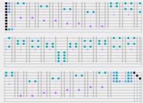
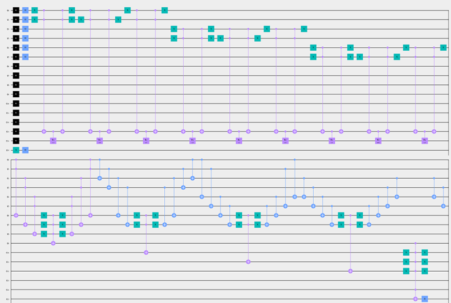
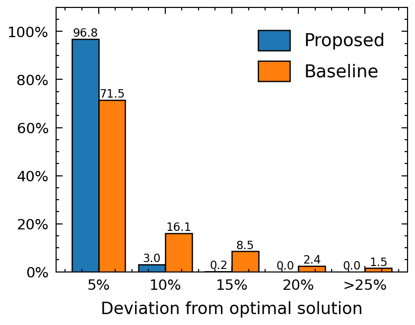
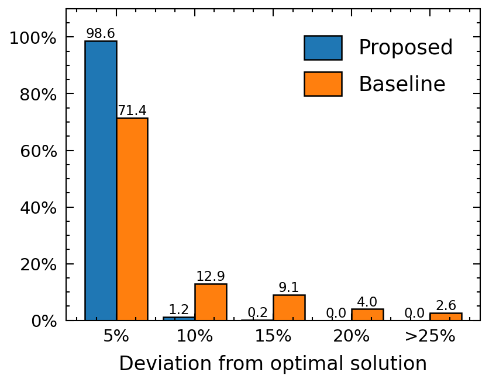
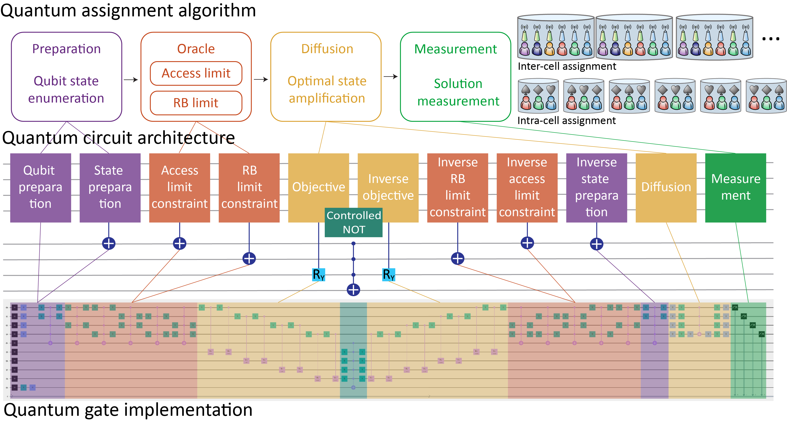

# CQF – Continuous-valued Quantum Framework for Network Assignment  
*A universal quantum framework for inter-/intra-cell resource optimisation*

> **Paper:** “A Universal Quantum Framework for Assignment Optimisation in  
> Network Administration” (IEEE X, 20xx)  
> **Authors:** Yong Hun Jang · Junyoung Hwang · Wookjin Lee · Sang Hyun Lee

> **Version note**  
> This repository contains code compatible with **Qiskit ≥ 1.0** (tested on 1.1).  
> Legacy support for Qiskit 0.46 is archived separately.

---

## 1. Overview: What is CQF?

CQF implements a gate-level quantum workflow for solving two key network management problems:

1. **Inter-cell user association** – Assign each User Equipment (UE) to the most suitable Access Point (AP), while enforcing access limits.
2. **Intra-cell resource block (RB) allocation** – Allocate RBs to UEs within the same AP to maximize total throughput.

A classical brute-force search requires evaluating all \|𝐶\| = M<sup>N</sup> configurations.  
CQF reduces this complexity using **amplitude amplification**, requiring only  
**O(√(\|𝐶\|⁄\|𝐹\|))** iterations.

This is achieved by:
- Encoding real-valued metrics (e.g., power, rate) directly into **qubit phases**.
- Enforcing combinatorial constraints using modular oracles.

---

## 2. Repository Layout

```text
CQF/
├── fig/                # All figures used in the paper and extended results
│   ├── fig1_network_overview.png
│   ├── fig2_quantum_flow.png
│   ├── fig3_qubit_encoding.png
│   ├── fig4_access_limit_oracles.png
│   ├── fig5_phase_rotation.png
│   ├── fig6_performance_korea_map.png
│   ├── inter_circuit.png
│   ├── intra_circuit.png
│   ├── inter_histogram.png
│   └── intra_histogram.png
├── qiskit>=1.0/             # Main implementation (Qiskit ≥ 1.0)
│   ├── inter_cell_demo.ipynb
│   ├── intra_cell_demo.ipynb
│   ├── oracle.py
│   ├── phase_utils.py
│   └── README_code.md
└── README.md
````

---

## 3. Five-Step Workflow (all notebooks)

| #     | Function / Cell                 | What happens                                                                                             |   |   |   |           |
| ----- | ------------------------------- | -------------------------------------------------------------------------------------------------------- | - | - | - | --------- |
| **1** | `generate_problem()`            | Build or load cost / power matrices, AP limits, etc.                                                     |   |   |   |           |
| **2** | `encode_state()`                | Allocate the *state register* (`N × ⌈log₂M⌉` qubits) and one auxiliary qubit.                            |   |   |   |           |
| **3** | `oracle.*()`                    | (a) flip the aux qubit if a configuration is **feasible**<br>(b) add a cost-proportional **phase kick**. |   |   |   |           |
| **4** | `run_amplitude_amplification()` | Apply the oracle → diffuser loop ⌊π⁄4 √(                                                                 | C | ⁄ | F | )⌋ times. |
| **5** | `decode_counts()`               | Map the most frequent bitstring back to UE↔AP or UE↔RB indices.                                          |   |   |   |           |

Each function has an inline docstring. Press **⇧ + Tab** in Jupyter to view it.

---

## 4. Key Modules

### `oracle.py`

```python
def build_access_limit(qc, state, aux, limit):
    """Flag states where any AP serves > `limit` UEs."""
```

*How to extend*: replace the inner combinatorial‐Toffoli section to support your own “k-of-n” rules.

### `phase_utils.py`

```python
def power_to_phase(p, p_min, p_max):
    """Linear map:   p_min → 0   and   p_max → π."""
```

*How to extend*: create `latency_to_phase()`, `snr_to_phase()`, … in the same style.

---

## 5. Visual Explanation of the Code (Backed by Figures)

This framework is not just theoretical — it produces measurable quantum outputs and interpretable results. Each notebook generates figures like those below. These figures explain what the code is doing at every stage.

---

### Assignment Outputs (Fig. 6-style)

The quantum algorithm solves both **inter-cell** (user-to-AP) and **intra-cell** (RB-to-user) problems.

<p align="center">
  
  <br><em>fig/fig6_performance_map.png — Visual overlay of both tasks on a campus map</em>
</p>

- Bottom left: Inter-cell assignment minimizes total power across APs under capacity limits.
- Top right: Intra-cell assignment maximizes total throughput to multiple UEs sharing an AP.
- Right panels: Histograms show how often the quantum algorithm outputs near-optimal solutions.

---

### Sampling Histograms: What did the quantum circuit return?

Each run samples the quantum register thousands of times. These histograms show the distribution of measured bitstrings.

<div align="center">
  
  <br><em>fig/inter_histogram.png — Output counts for inter-cell assignment (bitstrings → UE-AP mapping)</em>
</div>

<div align="center">
  
  <br><em>fig/intra_histogram.png — Output counts for intra-cell assignment (bitstrings → UE-RB mapping)</em>
</div>

Each spike corresponds to a feasible configuration. The most frequent one is typically optimal or very close to it.

---

### Quantum Circuits: What was actually run?

The actual Qiskit circuits generated by the notebooks include:
- State preparation
- Constraint enforcement via oracles
- Cost-aware phase rotation
- Amplitude amplification loop

<div align="center">
  
  <br><em>fig/inter_circuit.png — Circuit for inter-cell assignment with access limit oracle</em>
</div>

<div align="center">
  
  <br><em>fig/intra_circuit.png — Circuit for intra-cell RB allocation with exclusivity enforced</em>
</div>

These circuits are generated by calling:

```python
qc = build_access_limit(qc, state, aux, limit=2)
qc = build_phase_oracle(qc, state, cost_matrix, p_min, p_max)
````

You can swap in your own constraints or cost models by editing `oracle.py` or `phase_utils.py`.

---

### Accuracy Compared to Baseline

The figures below compare the quantum algorithm’s solution quality to classical baselines.

<div align="center">
  
  
  <br><em>fig/intra_dt_result.png and fig/inter_dt_result.png — % of solutions within X% of optimal</em>
</div>

* Blue bars: This framework (quantum)
* Orange bars: Greedy or exhaustive classical method

Over 95% of quantum outputs fall within 5% of the global optimum.

---

### Summary

| File                           | Output                                                            |
| ------------------------------ | ----------------------------------------------------------------- |
| `inter_cell_assignment*.ipynb` | `inter_histogram.png`, `inter_circuit.png`, `inter_dt_result.png` |
| `intra_cell_assignment*.ipynb` | `intra_histogram.png`, `intra_circuit.png`, `intra_dt_result.png` |

Every figure here is auto-generated by running the corresponding notebook. You can plug in your own cost matrix and constraints, and everything updates automatically.

---

## 6. Quick Start

```bash
git clone https://github.com/gyh1238/CQF.git
cd CQF

conda create -n cqf python=3.12       # or use venv/poetry
conda activate cqf
pip install "qiskit>=1.1" jupyterlab matplotlib

jupyter lab qiskit/inter_cell_assignment.ipynb
```

Change problem size in the first cell (`PROBLEM_SIZE = {...}`) and press **Run All**.

---

## 7. Drop-in Example

```python
from qiskit_oracle.oracle import build_access_limit, build_phase_oracle
from qiskit_oracle.driver import encode_state, run_amplitude_amplification, decode_counts

state, aux, qc = encode_state(num_ue=5, num_ap=2)
qc = build_access_limit(qc, state, aux, limit=2)
qc = build_phase_oracle(qc, state, cost_matrix, p_min, p_max)

amplified = run_amplitude_amplification(qc)
counts = amplified.simulate(shots=8192).get_counts()
best   = decode_counts(counts)[0]     # list of UE→AP indices
print(best)
```

Swap in your own `cost_matrix` and you have a ready-made quantum optimiser.

---

## 8. Glossary

| Term           | Meaning                                                       |
| -------------- | ------------------------------------------------------------- |
| **UE**         | User Equipment (handset, laptop, …)                           |
| **AP**         | Access Point (cell)                                           |
| **RB**         | OFDMA Resource Block                                          |
| **Oracle**     | Quantum circuit that marks feasible states (and adds a phase) |
| **Phase kick** | Rotate \|ψ⟩ by φ ∝ cost                                       |

---

## 9. Paper in One Paragraph

The accompanying paper formalises the continuous-valued assignment problem as a phase-encoded search and proves that the proposed oracle structure achieves a quadratic speed-up over exhaustive search while preserving solution optimality under noisy, real-valued link metrics. *If you just want to solve real networks, the code above is all you need; if you need proofs, read the PDF.*

---

## 10. Quantum Flow Diagram
<div align="center">  <br><em>Fig 2 – Quantum optimization loop used in CQF</em> </div>

---

## 11. Reproducing the Paper Figures

| Figure               | Contents                         | Generated from           |
| -------------------- | -------------------------------- | ------------------------ |
| Fig 1–5              | Conceptual illustrations         | Pre-drawn in Illustrator |
| Fig 6                | Campus simulation results        | inter/intra notebooks    |
| inter\_circuit.png   | Gate-level circuit (inter-cell)  | auto-generated           |
| intra\_circuit.png   | Gate-level circuit (intra-cell)  | auto-generated           |
| inter\_histogram.png | Output distribution (inter-cell) | from sampling            |
| intra\_histogram.png | Output distribution (intra-cell) | from sampling            |

---

## 12. Results and Visualization

CQF achieves high fidelity in both problems:

| Task                               | Exact-optimal hit-rate | ≤5% deviation |
| ---------------------------------- | ---------------------- | ------------- |
| Inter-cell power minimization      | 98.6%                  | 98.6%         |
| Intra-cell throughput maximization | 96.8%                  | 96.8%         |

### Inference Histograms

<div align="center">
  
  <br><em>Measured output bitstrings – inter-cell assignment</em>
</div>

<div align="center">
  
  <br><em>Measured output bitstrings – intra-cell assignment</em>
</div>

### Gate-Level Quantum Circuits

<div align="center">
  
  <br><em>Quantum circuit used in inter-cell demo</em>
</div>

<div align="center">
  
  <br><em>Quantum circuit used in intra-cell demo</em>
</div>

---

## 13. Citation

If you use CQF in your research, please cite the following article:

```bibtex
@article{jang2025cqf,
  title   = {A Universal Quantum Framework for Assignment Optimization in Network Administration},
  author  = {Jang, Yong Hun and Hwang, Junyoung and Lee, Wookjin and Lee, Sang Hyun},
  journal = {IEEE X},
  year    = {20xx}
}
```

---

## 14. Contact

For questions or contributions, open an issue or contact:
📧 **[disclose@korea.ac.kr](mailto:disclose@korea.ac.kr)**

---

<p align="center">
  
  <br><em>Fig 6 – Simulation results for Korea University campus deployment</em>
</p>
```

---
