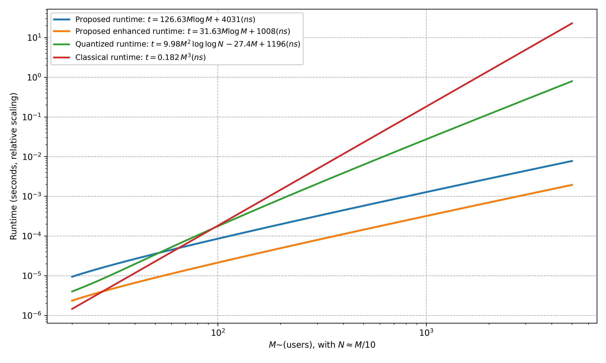

# CQF – Continuous-valued Quantum Framework for Network Assignment  
*A universal quantum framework for inter-/intra-cell resource optimisation*

> **Paper:** “A Universal Quantum Framework for Assignment Optimisation in  
> Network Administration” (IEEE X, 20xx)  
> **Authors:** Yong Hun Jang · Junyoung Hwang · Wookjin Lee · Sang Hyun Lee

> **Version note**  
> This repository contains code compatible with **Qiskit ≥ 1.0** (tested on 1.1).  
> Legacy support for Qiskit 0.46 is archived separately.

---

## 1. Overview: What is CQF?

CQF implements a gate-level quantum workflow for solving two key network management problems:

1. **Inter-cell user association** – Assign each User Equipment (UE) to the most suitable Access Point (AP), while enforcing access limits.
2. **Intra-cell resource block (RB) allocation** – Allocate RBs to UEs within the same AP to maximize total throughput.

A classical brute-force search requires evaluating all \|𝐶\| = M<sup>N</sup> configurations.  
CQF reduces this complexity using **amplitude amplification**, requiring only  
**O(√(\|𝐶\|⁄\|𝐹\|))** iterations.

This is achieved by:
- Encoding real-valued metrics (e.g., power, rate) directly into **qubit phases**.
- Enforcing combinatorial constraints using modular oracles.

---

## 2. CQF Architecture

The CQF pipeline consists of the following components:

- Classical Preprocessing
- Qubit/State Preparation
- Access/Resource Limit Constraint Oracle
- Objective Oracle
- Diffusion
- Measurement
- Classical Postprocessing

The following diagram illustrates the architecture of the CQF framework:

<div align="center">  <br><em>Fig 2 – Quantum optimization loop used in CQF</em> </div>

---

## 3. Repository Layout

```text
CQF/
├── fig/                # All figures used in the paper and extended results
│   ├── fig1_network_overview.png
│   ├── fig2_quantum_flow.png
│   ├── fig3_qubit_encoding.png
│   ├── fig4_access_limit_oracles.png
│   ├── fig5_phase_rotation.png
│   ├── fig6_performance_korea_map.png
│   ├── inter_circuit.png
│   ├── intra_circuit.png
│   ├── inter_histogram.png
│   └── intra_histogram.png
├── qiskit>=1.0/             # Main implementation (Qiskit ≥ 1.0)
│   ├── inter_assignment_qiskit1.1.ipynb
│   └── intra_assignment_qiskit1.1.ipynb
├── qiskit<1.0/             
│   ├── inter_cell_assignment_access_limit_only.ipynb
│   ├── inter_cell_assignment_objective.ipynb
│   ├── intra_cell_assignment_1_objective_aux.ipynb
│   └── intra_cell_assignment_3_objective_aux.ipynb
└── README.md
````

---

## 4. Five-Step Workflow

| #     | Function / Cell                 | What happens                                                                                             |
| ----- | ------------------------------- | -------------------------------------------------------------------------------------------------------- |
| **1** | `generate_problem`              | Build or load cost / power matrices, AP limits, etc.                                                     |
| **2** | `encode_state`                  | Allocate the *state register* (`N × ⌈log₂M⌉` qubits) and auxiliary qubits.                                |
| **3** | `oracle.*`                      | (a) flip the aux qubit if a configuration is **feasible**<br>(b) add a cost-proportional **phase kick**. |
| **4** | `run_amplitude_amplification`   | Apply the oracle → diffuser loop ⌊π⁄4 √(\|𝐶\|⁄\|𝐹\|)⌋ times.                                             |
| **5** | `decode_counts`                 | Map the most frequent bitstring back to UE↔AP or UE↔RB indices.                                          |

---

## 5. Visual Explanation of the Code (Backed by Figures)

This framework is not just theoretical — it produces measurable quantum outputs and interpretable results. Each notebook generates figures like those below. These figures explain what the code is doing at every stage.


### Quantum Circuits: What was actually run?

The actual Qiskit circuits generated by the notebooks include:
- State preparation
- Constraint enforcement via oracles
- Cost-aware phase rotation
- Amplitude amplification loop

This figure shows the quantum circuit constructed in the `q_circuit()` function:

<div align="center">
  
  <br><em>fig/inter_circuit.png — Circuit for inter-cell assignment with access limit oracle</em>
</div>

<div align="center">
  
  <br><em>fig/intra_circuit.png — The first half of circuit for intra-cell RB allocation with exclusivity enforced</em>
</div>

<!--
These circuits are generated by calling:

```python
qc = build_access_limit(qc, state, aux, limit=2)
qc = build_phase_oracle(qc, state, cost_matrix, p_min, p_max)
````

You can swap in your own constraints or cost models by editing `oracle.py` or `phase_utils.py`.
-->

### Sampling Histograms: What did the quantum circuit return?

Each run samples the quantum register thousands of times. These histograms show the distribution of measured bitstrings.

This histogram displays the output probabilities after executing the quantum circuit:
 
<div align="center">
  
  <br><em>fig/inter_histogram.png — Output counts for inter-cell assignment (bitstrings → UE-AP mapping)</em>
</div>

<div align="center">
  
  <br><em>fig/intra_histogram.png — Output counts for intra-cell assignment (bitstrings → UE-RB mapping)</em>
</div>

Each spike corresponds to a feasible configuration. The most frequent one is typically optimal or very close to it.

---

### Summary

| File                           | Output                                                            |
| ------------------------------ | ----------------------------------------------------------------- |
| `inter_cell_assignment*.ipynb` | `inter_histogram.png`, `inter_circuit.png`, `inter_dt_result.png` |
| `intra_cell_assignment*.ipynb` | `intra_histogram.png`, `intra_circuit.png`, `intra_dt_result.png` |

Every figure here is auto-generated by running the corresponding notebook. You can plug in your own cost matrix and constraints, and everything updates automatically.

---

<!--

## 6. Quick Start

```bash
git clone https://github.com/gyh1238/CQF.git
cd CQF

conda create -n cqf python=3.12       # or use venv/poetry
conda activate cqf
pip install "qiskit>=1.1" jupyterlab matplotlib

jupyter lab qiskit/inter_cell_assignment.ipynb
```

Change problem size in the first cell (`PROBLEM_SIZE = {...}`) and press **Run All**.

---

## 7. Drop-in Example

```python
from qiskit_oracle.oracle import build_access_limit, build_phase_oracle
from qiskit_oracle.driver import encode_state, run_amplitude_amplification, decode_counts

state, aux, qc = encode_state(num_ue=5, num_ap=2)
qc = build_access_limit(qc, state, aux, limit=2)
qc = build_phase_oracle(qc, state, cost_matrix, p_min, p_max)

amplified = run_amplitude_amplification(qc)
counts = amplified.simulate(shots=8192).get_counts()
best   = decode_counts(counts)[0]     # list of UE→AP indices
print(best)
```

Swap in your own `cost_matrix` and you have a ready-made quantum optimiser.

---

-->

## 6. Glossary

| Term           | Meaning                                                       |
| -------------- | ------------------------------------------------------------- |
| **UE**         | User Equipment (handset, laptop, …)                           |
| **AP**         | Access Point (cell)                                           |
| **RB**         | Resource Block                                          |
| **Oracle**     | Quantum circuit that marks feasible states (and adds a phase) |
| **Phase kick** | Rotate \|ψ⟩ by φ ∝ cost                                       |

---

## 7. Paper in One Paragraph

The accompanying paper formalises the continuous-valued assignment problem as a phase-encoded search and proves that the proposed oracle structure achieves a quadratic speed-up over exhaustive search while preserving solution optimality under noisy, real-valued link metrics. *If you just want to solve real networks, the code above is all you need; if you need proofs, read the PDF.*

---

## 8. Reproducing the Paper Figures

| Figure               | Contents                         | Generated from           |
| -------------------- | -------------------------------- | ------------------------ |
| Fig 1–5              | Conceptual illustrations         | Pre-drawn in Illustrator |
| Fig 6                | Campus simulation results        | inter/intra notebooks    |
| inter\_circuit.png   | Gate-level circuit (inter-cell)  | auto-generated           |
| intra\_circuit.png   | Gate-level circuit (intra-cell)  | auto-generated           |
| inter\_histogram.png | Output distribution (inter-cell) | from sampling            |
| intra\_histogram.png | Output distribution (intra-cell) | from sampling            |

---

## 9. Results and Visualization

CQF achieves high fidelity in both problems:

| Task                               | ≤5% deviation |
| ---------------------------------- | ------------- |
| Inter-cell power minimization      | 98.6%         |
| Intra-cell throughput maximization | 96.8%         |

### Inference Histograms

<div align="center">
  
  
  <br><em>Measured output bitstrings – inter-cell assignment / intra-cell assignment</em>
</div>

### Accuracy Compared to Baseline

The figures below compare the proposed quantum algorithm’s solution quality to quantized quantum baselines.
<div align="center">
  
  
  <br><em>fig/intra_dt_result.png and fig/inter_dt_result.png — % of solutions within X% of optimal</em>
</div>

* Blue bars: This framework
* Orange bars: Quantized Quantum method

Over 95% of quantum outputs fall within 5% of the global optimum.

### Assignment Outputs (With Digital Twin Implementation)

The quantum algorithm solves both **inter-cell** (user-to-AP) and **intra-cell** (RB-to-user) problems.

<p align="center">
  
  <br><em>Simulation results for X University campus deployment</em>
</p>

- Bottom left: Inter-cell assignment minimizes total power across APs under capacity limits.
- Top right: Intra-cell assignment maximizes total throughput to multiple UEs sharing an AP.
- Right panels: Histograms show how often the quantum algorithm outputs near-optimal solutions.

## 10. Complexity

This section summarizes the asymptotic and measured runtime models we use in CQF for a system with **M users** and **N resources** (we use the common regime **N ≈ M/10**). Unless noted otherwise, all logarithms are base‑2.

## 1) Empirical scaling (trendline fits)

We fit simple trendlines (units: **nanoseconds**) to the log–log curves obtained from our experiments. These capture practical constants while preserving the dominant growth rates.

* **Proposed runtime (baseline):**
  $t \;=\; 126.63\, M\,\log M\; +\; 4031 \;(\text{ns})$
* **Proposed runtime (enhanced):**
  $t \;=\; 31.63\, M\,\log M\; +\; 1008 \;(\text{ns})$
* **Quantized baseline:**
  $t \;=\; 9.98\, M^{2}\,\log\log N\; -\; 27.4\,M\; +\; 1196 \;(\text{ns})$
* **Classical (Hungarian, cubic fit):**
  $t \;=\; 0.182\, M^{3} \;(\text{ns})$

**Interpretation.** The proposed methods scale like **O(M,log M)** and stay below the quantized **O(M²,log\log N)** and classical **O(M³)** baselines beyond modest M. See the left plot for the fitted curves on log–log axes.



> **Axes.** Horizontal: users (M). Vertical: runtime in seconds (shown on a relative/log scale). We evaluate under the regime N ≈ M/10.

## 2) Exact gate‑count model → t‑depth × quantum cycle time

For the quantum versions we also provide an exact model derived from gate‑level **t‑depth** multiplied by a **quantum cycle time** $\tau$. We use $\tau = 50\,\text{ns}$ for the baseline and a reduced constant for the enhanced pipeline.

* **Proposed runtime (baseline):**
  $t \;=\; 50\,\text{ns}\;\Big[\; 2M\,\log M\; +\; 2M\,\log N\; +\; 2\log M\; +\; 2\log N\; +\; \log(M\,\log N) \;\Big]$

* **Proposed runtime (enhanced / pipelined):**
  $t \;=\; 12.5\,\text{ns}\;\Big[\; 2M\,\log M\; +\; 2M\,\log N\; +\; 2\log M\; +\; 2\log N\; +\; \log(M\,\log N) \;\Big]$
  The enhanced line uses the same depth expression but a smaller effective cycle time (e.g., deeper parallelism/pipelining), giving a $\times4$ constant‑factor improvement.

* **Quantized baseline:**
  $t \;=\; 50\,\text{ns}\;\Big[\; (M^{2}-M)\,\log\log N \;\Big]$

* **Classical (Hungarian):**
  $t \;=\; \alpha\,M^{3}$
  where $\alpha$ is fitted for a reference machine (\~48 cores @ 3.5 GHz, \~90 GB/s memory BW), to overlay the dashed curve in the plot below.

### Notes & assumptions

* Regime: **N ≈ M/10** throughout the figures.
* Logarithms are base‑2; constant terms inside logs reflect register sizing and control.
* Units on the vertical axis are seconds (log scale); formulas above show **ns** coefficients to match cycle‑level models.
* The enhanced curve reflects improved constant factors via parallel organization; the asymptotic order remains **O(M log M)**.

---

## How we derive these formulas (gate model → t‑depth → runtime)

Below is the gate‑level origin of the expressions used in the two plots. We count Clifford+T gates under the **relative‑phase Toffoli** cost model (4 T, T‑depth 1). Let

* **M** = number of UEs, **N** = number of APs,
* **k** = ⌈log₂N⌉ (address bits), **w** = ⌈log₂(M+1)⌉ (per‑AP counter width),
* **τ** = t\_cycle (quantum cycle time; 50 ns for the baseline),
* **τ(ε)** = synthesis cost for one controlled phase (≈ Θ(log(1/ε))).

### A) Oracle (access‑limit check + mark)

1. **(u,a) flag, \[sel₍u₎=a]**
   XNORs (Clifford) + k‑input AND via a Toffoli tree → **2(k−1)** Toffoli per flag, forward+uncompute.
   For all **MN** flags:
   `T_flag = MN · 8(k−1)`.

2. **Conditional +1 into AP counter (width w)**
   Ripple increment once per (u,a) when the flag is 1. Per increment ≈ **2w−1** Toffoli (no reverse compute of the increment itself):
   `T_inc = MN · (8w − 4)`.

3. **Per‑AP limit compare (≤Uₐ) and global AND, then mark**
   Per AP compare (do+undo) ≈ **2w** Toffoli → **8w** T‑count; AND over **N** AP results (do+undo) = **2(N−1)** Toffoli → **8(N−1)** T‑count:
   `T_limit = 8Nw + 8(N−1)`.

4. **Optional weight phases**
   `T_wt = MN · τ(ε)`.

**Oracle total (T‑count)** — dominant term:
`T_oracle = MN·8(k+w) + 8Nw + 8(N−1) + MN·τ(ε)`.

**Oracle T‑depth**
With sufficient parallelism (compute all flags in parallel; balance trees for popcount/AND):
`D_oracle = Θ(k + w·log M + log N)`.
With limited parallelism (conservative):
`D_oracle ≈ Θ(N·log N)`.

### B) Diffusion (Grover reflection)

For the **Mk**‑bit selection register:
T‑count ≈ `c_diff · Mk`.
T‑depth ≈ `Θ(log(Mk)) = Θ(log M + log log N)`.

### C) oracle + diffusion

`T_total = 8MN(k+w) + 8Nw + 8(N−1) + MN·τ(ε) + c_diff·Mk`
`D_total = Θ(k + w·log M + log N) + Θ(log M + log log N)`

**Runtime rule.** Clifford cost is 0; `t ≃ D_T · τ` for one iteration. With iteration count `R ≃ \~O(√(|C|/|F|))`, the end‑to‑end runtime is `t_total ≃ R · D_T · τ`.

### Mapping to the plotted formulas

* **Exact model plot.** Substitute `k ≈ log₂N`, `w ≈ log₂M`, balance the trees, and keep only depth‑contributing terms →
  `D_T ≈ 2M·log M + 2M·log N + 2·log M + 2·log N + log(M·log N)`.
  The last term comes from diffusion over a register of size `Mk`. Multiply by `τ = 50 ns` (baseline) for the blue curve; the **enhanced** curve multiplies the same depth by `τ = 12.5 ns` to reflect a 4× constant‑factor improvement (pipelining/parallel scheduling).
* **Trendline plot.** Fit `t = a·M·log M + b` (ns) to the exact‑model points. With `N ≈ M/10`, `log N ≃ log M − log 10` is absorbed into the constant and linear‑in‑log terms. This yields the reported coefficients (e.g., 126.63 and 31.63 for baseline/enhanced).
* **Quantized baseline.** Use analytic driver `(M²−M)·log log N`, multiply by `50 / 5 ns`. 5 means using more 4logN bits. (constant-factor improvement for comparison)
* **Classical.** Use `t = τ·M³`, with `τ` fitted on a reference workstation to overlay the dashed curve.

> Using **standard Toffoli (7 T)** instead of relative‑phase Toffoli scales all T‑counts by **7/4**; depths stay the same up to constants.

---

## 11. Citation

If you use CQF in your research, please cite the following article:

```bibtex
@article{jang2025cqf,
  title   = {A Universal Quantum Framework for Assignment Optimization in Network Administration},
  author  = {Yong Hun Jang, Junyoung Hwang, Wookjin Lee  and Sang Hyun Lee},
  journal = {IEEE X},
  year    = {20xx}
}
```

---

## 12. Contact

For questions or contributions, open an issue or contact:
📧 **[gyh1237@gmail.com](mailto:gyh1237@gmail.com)**
